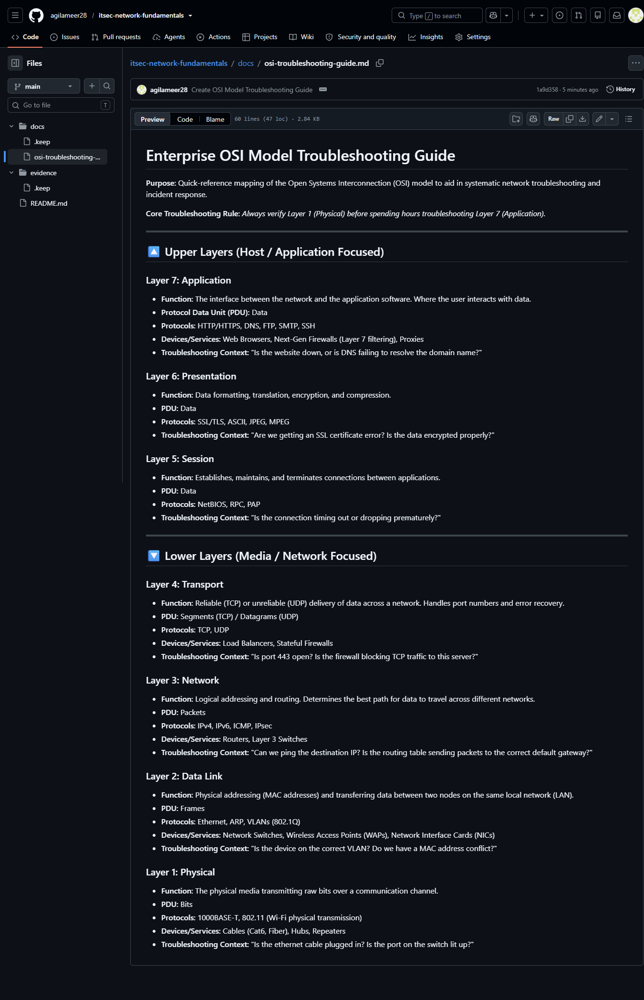

### Summary
Conducted independent research on network topologies and the OSI model, synthesizing the data into a technical troubleshooting cheat sheet for Help Desk reference.

### Environment
* *Platform:* GitHub (Markdown Documentation)
* *Concepts:* OSI Model (Layers 1-7), TCP/IP, LAN/WAN Topologies, Routing & Switching.

### Diagnostic / Execution Steps
1. Researched network encapsulation and the OSI model via enterprise documentation (Cloudflare) and industry-standard training (Messer).
2. Authored a technical reference guide mapping devices (Switches, Routers) and protocols (TCP/UDP, IP, HTTP) to their respective layers.
3. Created a Markdown-based cheat sheet stored in the repository's /docs structure.

### Evidence

### Lessons Learned
Creating structured documentation reinforces theoretical concepts. Understanding the OSI model is critical for isolating network failures; troubleshooting must always move logically up or down the layers.
